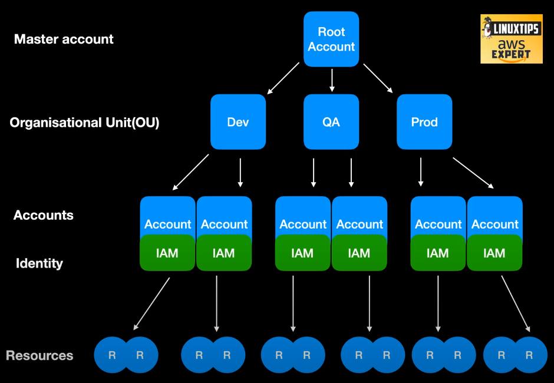
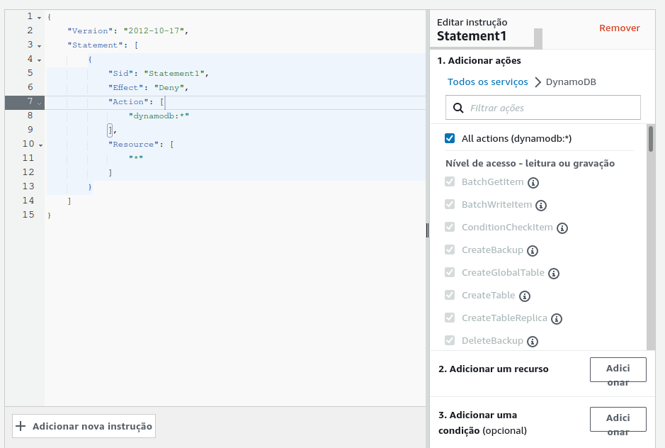

# Day 02 - Foundation, Onboarding and Landing Zone

> Conseguir planejar a melhor forma de usar Cloud Computing para o seu produto.

## Root Account
Conta principal de todos os recursos da AWS, podendo criar a partir dela sub-contas e organizações. Também usada no controle de cobranças (Billing) dos recursos utilizados.

## Unidade Organizacional (OU)
Feita para organizar contas, podendo aplicar regras e políticas para cada uma trazendo assim mais segurança.

## Sub-Accounts
Responsável pela execução dos recursos. Possui uma camada de identidade (IAM).
Na prática, se faz necessário apenas um nome e um e-mail válido para criar cada sub-conta, porém, é recomendado utilizar um e-mail para o time responsável pelos recursos em execução nessa sub-conta, que principalmente, que ALGUÉM LEIA os e-mails que chegarem da Amazon, assim minimiza os riscos do seu ***SCORE*** na AWS diminuir por não realizar certos tipos de verificações de conta.

## Camada de Identidade (IAM)
Cada conta possui uma credêncial de acesso própria, porém, é permitido configurar contas de origens e destinos para cada uma. Por exemplo, todos os usuários podem acessar a conta de DEV, e a partir dela, acessar a conta de HOMOLOGAÇÃO sem precisar entrar com outras credênciais. É possível também criar regras e políticas para que sejam limitadas as ações desse usuário caso tenha acessado por outra sub-conta.

## My Security Credentials
- Acessar a opção *Autenticação multifator (MFA)*;
- Escolher o método de autenticação.

## Support Center
> Uma solicitação de suporte para a AWS é chamado de Case.

São 3 tipos de casos:
- Account and billing support;
- Service limit increase;
- Technical support (não liberado para o plano FREE).

## Policies
São 2 tipos de políticas:
- IAM: Aplicadas diretamente ao usuário;
- Service Control Policy: Aplicadas nas contas e nas organizações.

Exemplo de Service Control Policy:

