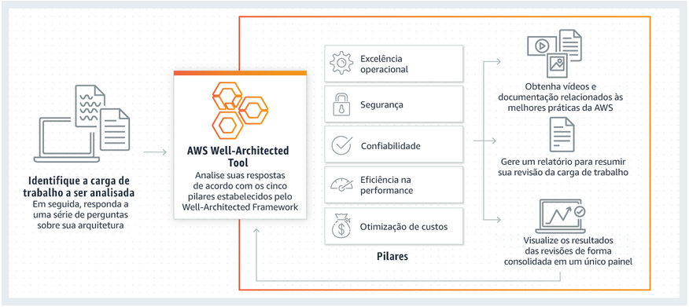

# Day 03 - Well-Architected

> Framework criado pela AWS que tem como objetivo reunir ferramentas e pilares das boas práticas no Cloud Computing.

## Prioridade dos Pilares

1. Excelência operacional;
2. Segurança;
3. Confiabilidade;
4. Eficiência de performance;
5. Otimização de custos;
6. Sustentabilidade.